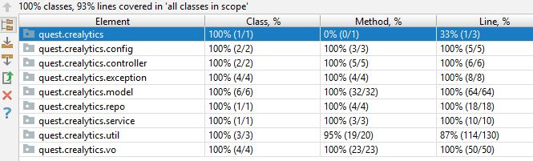
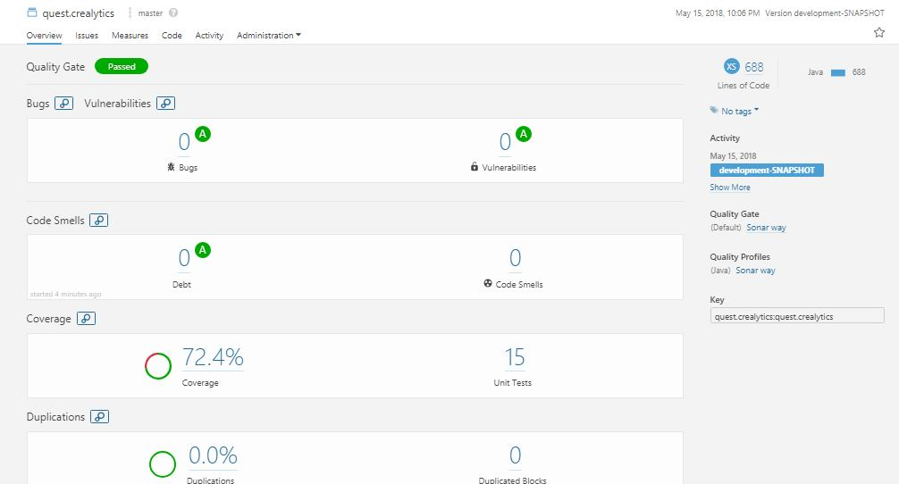

# crealytics-quest

# Solution

## Technologies
### Language
*   Java 1.8
### Build Tool
*   Maven 3.5
### Frameworks Used
* Spring Boot 2.0.0.RELEASE
* Cucumber 1.2.5'

## Test cases
#### To run all test cases please run:
~~~shell
mvn clean verify -P all-test
~~~

### JUnit Test cases
You can find unit test cases under package *quest.crealytics* .
Test cases are written using JUnit to test functionality of methods in classes.

#### To run unit test cases please run:
~~~shell
mvn clean test
~~~
**Coverage Report:** target/coverage-reports/jacoco-ut.exec

**Surefire reports** target/surefire-reports 

**Coverage Html Report:** target/jacoco-ut/index.html

### Behavior-driven development Test cases
You can find *Behavior-driven development(BDD)* cases under package *bdd* and feature files under test resources

Cucumber is used to implement BDD
#### To run BDD test cases please run:
~~~shell
mvn clean verify -P integration-test
~~~
**Coverage Report:** target/coverage-reports/jacoco-ut.exec

**Failsafe reports** target/failsafe-reports

**Coverage Html Report:** target/site/jacoco-it/index.html

## Code Coverage

### Intellij Idea Code Coverage

### Sonar Code coverage

## To run the application please execute following cammand 

### With data from resource folder 
~~~shell
java -jar target/quest.crealytics-development-SNAPSHOT-spring-boot.jar
~~~

### With data from external folder 
~~~shell
java -jar target/quest.crealytics-development-SNAPSHOT-spring-boot.jar -Dcrealytics.data.dir=<directory-to-csv-files>
~~~